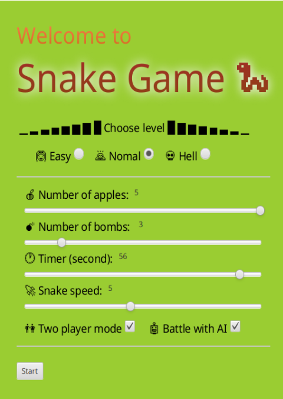
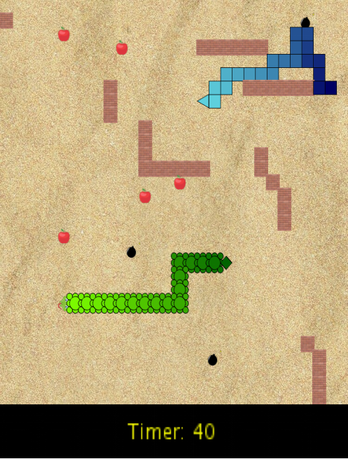
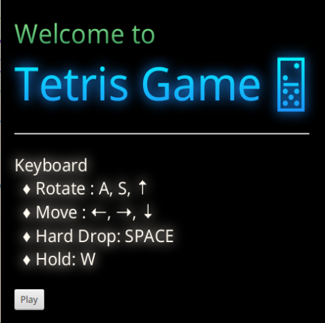
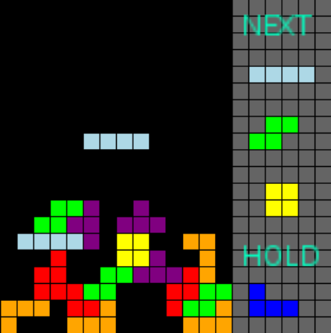

<!-- # Two old-school games with fancy features and GUI -->

# Snake game with an AI bot
| welcome page           |  game interface |
|:-------------------------:|:-------------------------:|
|  | |
<!--   -->

## Levels in the snake game

*   The game sets levels by placing several walls on the grids. In this game, there are three types of wall:
    *   Vertical
    *   Horizontal
    *   Oblique (with random angel)

    _( Every single wall object is guaranteed to be consecutive, whilst the connections between every two walls are random in order to prevent the wall-bricks from scattering all over the grid. )_

*   Different game levels correspond to different numbers of wall-brick. 
*   Before the game started, players can use the game menu to choose 3 different levels:
    *   Easy level: 4 wall-bricks
    *   Normal level: 12 wall-bricks
    *   Hell level: 20 wall-bricks

_( If no level is chosen, then no wall will be placed whatsoever (the Default level) )_


## Two-player mode


*   Before the game started, players can use the game menu to choose the "Two-player mode" option to add another player;
*   The original player, the host, controls the green snake with Up, Down, Right, Left-Key; the second player, the rival, controls the blue snake with W, S, A, D-Key;
*   In the game, the two snakes can only collide with itself but not with each other.


## Snake AI


*   Before the game gets started, players can use the game menu to choose the "Battle with AI" option which will generate a blue AI snake as the rival;
*   The AI algorithm is implemented as follows:
    *   the AI snake is able to find the closest apple in the grid and go straight to it so that the AI can grow as fast as possible;

    ( This is a time-race game that could also have multiple apples in the grid. Those are additional features that will be described below. )

    *   the AI snake is provided with a "vision" of the grid in a 7 grid-cell radius (adjustable) from its head so that it can "look" 7 steps further;
    *   the 4 directions: East, West, North, South are ranked based on this "vision". The AI snake will then make a decision by using a straightforward greedy algorithm.
    *   as a result, the AI is able to grow as fast as possible and, avoid walls, bombs (described below) and its body (most of the time).


## Game menu


*   Before the game started, players are provided with a GUI menu as shown on the first page;
*   On the menu, users can
    *   choose the game level;
    *   choose the number of apples that maintained during the game;
    *   choose the number of bombs that maintained during the game;
    *   choose the "Two-player mode" and "Battel with AI" options;
    *   set the snake speed;
    *   set the timer value;
    *   get started by clicking the start button (cancel by closing the menu window right away);


## Nicer Snake graphics


*   The graphics of both the host and rival snakes have been improved;
*   The graphics of the apple has been improved;
*   The graphics of the background (the grid) has been improved;
*   The graphics of the game over screen has been improved in a way that user can see the winner or loser together with the higher score;
*   The graphics of the game menu has been improved.
*   Added Bombs and walls graphics;
*   Added timer area;


## Updated features of the snake game


### Variable number of apples


*   In the beginning, players are able to choose the number of apples, from 1 (default) to 5 (adjustable), that maintained during the game;


### Variable number of bombs


*    In the beginning, players are able to choose the number of bombs, from 0 (default) to 10 (adjustable), that maintained during the game;
*   Each bomb will cause the snake to loose one trunk of its body. The game will end when any snake with only head remains hits the bomb.


### A race against time


*   In this game setting, players can customize the timer before the game starts;
*   When time out occurs, the snake with a longer body wins. 


### Maintain Reversibly


*   All game options ( two-player mode, AI mode, multi-items, etc.) are reversible;


### Run the project from CLI


```sh
$ source /etc/profile.d/gradle.sh
$ gradle run
```

************

# Tetris game
| welcome page           |  game interface |
|:-------------------------:|:-------------------------:|
|  | |
<!-- 
  -->

## Hold tetromino


*   Users can use W-key to hold the current tetromino. As most of the Tetris games, this option will be disabled until the newly generated tetromino properly land. 


## Display next blocks


*   The next 3 tetrominoes will be displayed on the right-hand side of the board.


## Better Tetris graphics


*   The held tetromino will be displayed along with the next coming tetrominoes on the right-hand side of the board;
*   The finish screen has been improved.


## Upated features


*   A welcome GUI with keyboard control instruction is added.


## Run the project from CLI


```sh
$ source /etc/profile.d/gradle.sh
$ gradle run
```
